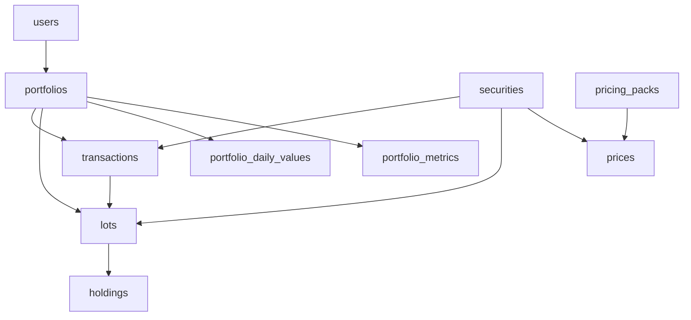

# DawsOS Seed Data Architecture Report

**Date**: November 6, 2025  
**System**: DawsOS Portfolio Intelligence Platform
**Analysis By**: Replit Agent

## Executive Summary

The DawsOS system requires a carefully orchestrated set of seed data to function properly. The architecture follows a **hierarchical dependency model** where core entities (users, portfolios, securities) must exist before dependent data (transactions, lots, prices) can be populated. The system is designed to operate with minimal seed data but becomes more valuable with richer historical data.

## Seed Data Architecture

### 1. Core Dependency Hierarchy

```
Level 1 (Foundation):
├── users (Authentication & Authorization)
└── securities (Global Security Master)

Level 2 (Portfolio Structure):
├── portfolios (User-owned containers)
└── pricing_packs (Point-in-time price snapshots)

Level 3 (Portfolio Data):
├── transactions (Trade history)
├── lots (Tax lot accounting)
└── holdings (Current positions)

Level 4 (Derived Data):
├── portfolio_daily_values (Historical NAV)
├── portfolio_metrics (Performance calculations)
├── economic_indicators (Macro factors)
└── fx_rates (Currency conversion)
```

### 2. Current Seed Data State

**Database Population (as of Nov 6, 2025)**:

| Table | Records | Purpose | Critical? |
|-------|---------|---------|-----------|
| users | 4 | Authentication | **YES** |
| portfolios | 1 | Container for holdings | **YES** |
| securities | 17 | Security definitions | **YES** |
| pricing_packs | 504 | Price snapshots | **YES** |
| prices | 72 | Security prices | **YES** |
| transactions | 65 | Trade history | **YES** |
| lots | 17 | Tax lots | **YES** |
| holdings | 9 | Current positions | Optional |
| portfolio_daily_values | 502 | Historical NAV | Optional |
| portfolio_metrics | 505 | Performance | Optional |
| economic_indicators | 1,310 | Macro data | Optional |
| fx_rates | 67 | FX conversion | Optional |

### 3. Minimum Viable Seed Data

**Essential for System Operation**:

```sql
-- 1. At least one user (for authentication)
INSERT INTO users (email, password_hash, role)
VALUES ('michael@dawsos.com', '[bcrypt_hash]', 'ADMIN');

-- 2. At least one portfolio
INSERT INTO portfolios (user_id, name, base_currency)
VALUES ('[user_id]', 'Main Portfolio', 'USD');

-- 3. Securities referenced in transactions
INSERT INTO securities (symbol, name, security_type, trading_currency)
VALUES 
  ('BRK.B', 'Berkshire Hathaway B', 'equity', 'USD'),
  ('BAM', 'Brookfield Asset Management', 'equity', 'USD'),
  -- ... other securities

-- 4. Pricing packs for valuation
INSERT INTO pricing_packs (id, market_state, pack_version)
VALUES ('PP_2025-11-03', 'CLOSED', 'D1');

-- 5. Prices for securities
INSERT INTO prices (security_id, pricing_pack_id, price, currency)
VALUES ('[security_id]', 'PP_2025-11-03', 358.00, 'USD');

-- 6. Transactions for portfolio history
INSERT INTO transactions (portfolio_id, transaction_type, security_id, ...)
VALUES ('[portfolio_id]', 'BUY', '[security_id]', ...);

-- 7. Lots for current positions
INSERT INTO lots (portfolio_id, security_id, quantity, cost_basis)
VALUES ('[portfolio_id]', '[security_id]', 130, 43670.40);
```

### 4. Seed Data Files & Scripts

**Primary Seed Files**:

1. **`migrations/seeds/seed_portfolio_data.sql`** (409 lines)
   - Main seed script for michael@dawsos.com portfolio
   - Contains: 9 securities, 65 transactions, 17 lots, 9 holdings
   - Purpose: Realistic portfolio with multi-currency positions

2. **`backend/scripts/seed_coherent_portfolio_data.py`** (375 lines)
   - Python script for generating coherent historical data
   - Creates: portfolio_daily_values with realistic NAV progression
   - Tracks: $620K in contributions, realistic appreciation

3. **`backend/scripts/seed_portfolio_performance_data.py`**
   - Generates performance metrics
   - Creates: TWR, Sharpe ratios, volatility calculations

4. **`backend/scripts/seed_missing_macro_indicators.py`**
   - Populates economic indicator data
   - Creates: 5 macro series (DFII10, T10YIE, BAMLC0A0CM, DTWEXBGS, SP500)

### 5. Architectural Intentions

**Pattern-Driven Design**:
- Seed data enables all 13 patterns in `backend/patterns/`
- Each pattern requires specific data relationships
- Example: `portfolio_overview` needs portfolios → lots → prices

**Test Portfolio Structure**:
- **User**: michael@dawsos.com (ADMIN role)
- **Portfolio ID**: 64ff3be6-0ed1-4990-a32b-4ded17f0320c
- **Base Currency**: USD
- **Holdings**: 9 positions across equities, ETFs, cash
- **Multi-Currency**: CAD (CNR), EUR (EVO), USD (others)
- **Time Period**: Nov 2023 - Oct 2025 (2 years of history)

**Data Coherence Requirements**:
1. **Temporal Consistency**: Transactions → Lots → Holdings must align
2. **Balance Sheet**: Cash + Securities = Total NAV
3. **Price Continuity**: Daily pricing packs for valuation
4. **Tax Lot Accounting**: FIFO/LIFO compliance

### 6. Critical Data Relationships



### 7. Seed Data Validation Queries

```sql
-- Check data consistency
SELECT 
    'Portfolio Balance' as check_type,
    SUM(quantity * cost_basis_per_share) as total_cost_basis
FROM lots 
WHERE portfolio_id = '64ff3be6-0ed1-4990-a32b-4ded17f0320c'
  AND is_open = true;

-- Verify pricing coverage
SELECT 
    COUNT(DISTINCT l.security_id) as securities_in_lots,
    COUNT(DISTINCT p.security_id) as securities_with_prices
FROM lots l
LEFT JOIN prices p ON l.security_id = p.security_id
WHERE l.portfolio_id = '64ff3be6-0ed1-4990-a32b-4ded17f0320c';

-- Check transaction completeness
SELECT transaction_type, COUNT(*) as count, SUM(amount) as total_amount
FROM transactions
WHERE portfolio_id = '64ff3be6-0ed1-4990-a32b-4ded17f0320c'
GROUP BY transaction_type;
```

### 8. Seed Data Execution Order

```bash
# 1. Initialize database schema
psql $DATABASE_URL < backend/db/schema/001_portfolios_lots_transactions.sql
psql $DATABASE_URL < backend/db/schema/pricing_packs.sql
# ... other schema files

# 2. Seed core data
psql $DATABASE_URL < migrations/seeds/seed_portfolio_data.sql

# 3. Generate derived data
python backend/scripts/seed_coherent_portfolio_data.py
python backend/scripts/seed_portfolio_performance_data.py
python backend/scripts/seed_missing_macro_indicators.py

# 4. Build pricing packs
python backend/jobs/build_pricing_pack.py

# 5. Compute metrics
python backend/jobs/compute_metrics_simple.py
```

## Key Insights

1. **Hierarchical Dependencies**: Data must be loaded in specific order due to foreign key constraints
2. **UUID Consistency**: The system uses specific UUIDs (e.g., portfolio 64ff3be6-...) that patterns expect
3. **Pricing Pack Convention**: Uses `PP_YYYY-MM-DD` format, no `PP_latest` fallback
4. **Multi-Currency Support**: System handles USD, CAD, EUR with FX conversion
5. **Pattern Requirements**: Each pattern has specific data needs (e.g., factor_analysis needs economic_indicators)

## Recommendations

1. **Create Seed Data Manager**: Build a CLI tool to manage seed data lifecycle
2. **Add Data Validation**: Implement checks to ensure seed data consistency
3. **Document Dependencies**: Create dependency graph for each pattern's data requirements
4. **Version Seed Data**: Track seed data versions for reproducible environments
5. **Minimal vs Full Seeds**: Offer "minimal" (quick start) vs "full" (demo) seed options

## Conclusion

The DawsOS seed data architecture is well-designed for demonstrating full platform capabilities. The michael@dawsos.com portfolio serves as a comprehensive test case with realistic multi-currency holdings, two years of history, and complete transaction records. The system gracefully handles missing optional data while requiring core entities for basic operation.