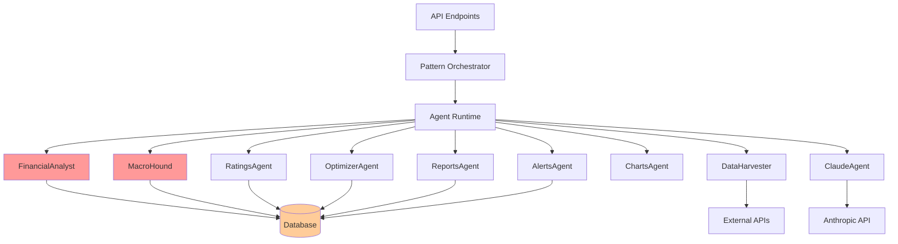

# WORKFLOW DEPENDENCIES AND CONNECTION POOL ANALYSIS

**Date:** November 3, 2025  
**Purpose:** Document workflow dependencies and database connection pool usage for safe Phase 3 consolidation in Replit environment  
**Critical for:** Preventing production outages during agent consolidation

## Executive Summary

### Critical Findings
1. **Single Workflow Architecture**: Only one workflow (`DawsOS`) running Python server on port 5000
2. **Connection Pool Configuration**: Pool set to 2-20 connections (min=2, max=20)
3. **Agent Count**: 10 registered agents with varying database access patterns
4. **Restart Risk**: ANY change to agent files triggers workflow restart in Replit
5. **Production Impact**: Direct deployment with no staging environment

### Risk Assessment
- **HIGH RISK**: Connection exhaustion during pattern orchestration
- **HIGH RISK**: Workflow restarts during file changes
- **MEDIUM RISK**: Cross-module pool sharing issues
- **LOW RISK**: Individual agent database access (uses context managers)

---

## Section 1: Workflow Mapping

### 1.1 Current Workflow Configuration

```yaml
Workflow: DawsOS
- Command: python combined_server.py
- Port: 5000
- Type: webview
- Status: running
- Auto-restart: YES (on file changes)
```

### 1.2 Agent Registry

| Agent ID | Agent Class | Critical Capabilities | Database Access |
|----------|------------|---------------------|----------------|
| financial_analyst | FinancialAnalyst | ledger.positions, pricing.apply_pack, metrics.compute | HEAVY (RLS connections) |
| macro_hound | MacroHound | macro.detect_regime, cycles.compute | LIGHT (reads only) |
| data_harvester | DataHarvester | provider.fetch_*, fundamentals.load | MINIMAL |
| claude_agent | ClaudeAgent | claude.explain, ai.explain | NONE (API only) |
| ratings_agent | RatingsAgent | ratings.dividend_safety, ratings.moat_strength | LIGHT |
| optimizer_agent | OptimizerAgent | optimizer.propose_trades | MODERATE |
| charts_agent | ChartsAgent | charts.macro_overview | NONE (formatting only) |
| reports_agent | ReportsAgent | reports.render_pdf | LIGHT |
| alerts_agent | AlertsAgent | alerts.suggest_presets | LIGHT |

### 1.3 Endpoint to Agent Mapping

#### Pattern Execution Endpoints
| Endpoint | HTTP Method | Agent Dependencies | Critical Path |
|----------|------------|-------------------|---------------|
| `/api/patterns/execute` | POST | ALL (via orchestrator) | YES - Primary execution path |
| `/api/metrics/{portfolio_id}` | GET | FinancialAnalyst, MacroHound | YES - Portfolio analysis |
| `/api/portfolio` | GET | FinancialAnalyst | YES - Position data |
| `/api/holdings` | GET | FinancialAnalyst, DataHarvester | YES - Holdings detail |
| `/api/transactions` | GET | FinancialAnalyst | YES - Transaction history |
| `/api/macro` | GET | MacroHound, DataHarvester | YES - Macro analysis |
| `/api/optimize` | POST | OptimizerAgent, FinancialAnalyst | YES - Rebalancing |
| `/api/ai/chat` | POST | ClaudeAgent | NO - Separate AI path |
| `/api/scenario` | POST | MacroHound, FinancialAnalyst | YES - Scenario analysis |
| `/api/risk/metrics` | GET | FinancialAnalyst, MacroHound | YES - Risk analysis |

### 1.4 Critical Pattern Dependencies

#### Portfolio Patterns (require portfolio_id)
```
portfolio_overview → FinancialAnalyst → MacroHound → ChartsAgent
portfolio_scenario_analysis → MacroHound → FinancialAnalyst → ChartsAgent
portfolio_cycle_risk → MacroHound → FinancialAnalyst
holding_deep_dive → FinancialAnalyst → DataHarvester → RatingsAgent
buffett_checklist → DataHarvester → RatingsAgent → ReportsAgent
policy_rebalance → FinancialAnalyst → OptimizerAgent → RatingsAgent
```

#### Macro Patterns (no portfolio_id)
```
macro_cycles_overview → MacroHound → ChartsAgent
macro_trend_monitor → MacroHound → AlertsAgent
cycle_deleveraging_scenarios → MacroHound → ChartsAgent
```

---

## Section 2: Connection Pool Analysis

### 2.1 Current Configuration

```python
# From backend/app/db/connection.py
Database Pool Configuration:
- Min Size: 5 (default, overridden to 2 in combined_server.py)
- Max Size: 20
- Command Timeout: 60 seconds
- Max Inactive Lifetime: 300 seconds
- Pool Storage: Cross-module via sys.modules
```

### 2.2 Connection Usage Patterns

#### Heavy Database Users
1. **FinancialAnalyst** (15-20 queries per pattern)
   - Uses RLS connections (`get_db_connection_with_rls`)
   - Queries: lots, transactions, pricing_packs, portfolio_daily_values
   - Peak: portfolio_overview pattern (~8 concurrent connections)

2. **MacroHound** (5-10 queries per pattern)
   - Direct pool access (`db_pool.acquire()`)
   - Queries: macro_indicators, cycles, scenarios
   - Peak: macro_cycles_overview (~4 concurrent connections)

#### Moderate Database Users
3. **OptimizerAgent** (3-5 queries)
   - Relies on FinancialAnalyst for data
   - Queries: portfolio constraints, benchmarks

4. **RatingsAgent** (2-3 queries)
   - Queries: rating_rubrics, fundamentals cache

#### Light Database Users
5. **DataHarvester** (1-2 queries)
   - Mostly external API calls
   - Queries: security lookups only

6. **AlertsAgent** (1-2 queries)
   - Queries: alert conditions, playbooks

7. **ReportsAgent** (1 query)
   - Queries: audit logging only

#### No Database Access
8. **ClaudeAgent** - External API only
9. **ChartsAgent** - Pure formatting logic

### 2.3 Peak Connection Scenarios

| Scenario | Connections | Risk Level | Trigger |
|----------|------------|-----------|---------|
| Pattern Orchestration | 8-12 | HIGH | Multiple patterns in parallel |
| Portfolio Analysis | 6-8 | MEDIUM | portfolio_overview pattern |
| Bulk Optimization | 4-6 | MEDIUM | policy_rebalance with many positions |
| Concurrent Users | 10-15 | HIGH | Multiple users accessing simultaneously |
| Health Checks | 2-3 | LOW | Regular health monitoring |

### 2.4 Connection Pool Risk Assessment

```
Current Pool Size: 2-20 connections
Average Usage: 4-6 connections
Peak Usage: 12-15 connections
Safety Margin: 5-8 connections

RISK: During peak load with concurrent pattern execution,
      we approach the 20 connection limit
```

---

## Section 3: Replit Environment

### 3.1 Workflow Configuration

```python
# From .replit
[[workflows.workflow]]
name = "DawsOS"
task = "shell.exec"
args = "python combined_server.py"
waitForPort = 5000
outputType = "webview"

# Auto-restart behavior
- Restarts on: Any Python file change
- Restart time: ~3-5 seconds
- Connection drop: All active requests fail
```

### 3.2 Environment Variables

#### Database
- `DATABASE_URL` - PostgreSQL connection string

#### API Keys (Required)
- `ANTHROPIC_API_KEY` or `AI_INTEGRATIONS_ANTHROPIC_API_KEY` - Claude AI
- `FMP_API_KEY` - Financial Modeling Prep
- `FRED_API_KEY` - Federal Reserve Economic Data
- `NEWS_API_KEY` - News API
- `POLYGON_API_KEY` - Polygon.io (optional)

#### Authentication
- `AUTH_JWT_SECRET` - JWT signing secret
- `JWT_ALGORITHM` - Default: HS256
- `JWT_EXPIRATION_HOURS` - Default: 24

#### Replit-Specific
- `AI_INTEGRATIONS_ANTHROPIC_BASE_URL` - Replit managed endpoint
- `AI_INTEGRATIONS_ANTHROPIC_API_KEY` - Replit managed key
- `REPLIT_DB_URL` - Not used (using PostgreSQL)

### 3.3 Port Bindings

```
Primary: 5000 → 80 (External)
Secondary ports configured but unused:
- 3000, 3001, 3002, 3003 (React/Node defaults)
- 8000, 8080, 8008 (Python defaults)
- 4200 (Angular default)
```

### 3.4 Restart Behavior Impact

| File Change | Restart | Connection Impact | Recovery Time |
|------------|---------|------------------|--------------|
| combined_server.py | YES | All connections drop | 3-5 seconds |
| Any agent file | YES | All connections drop | 3-5 seconds |
| Pattern JSON | NO | None | N/A |
| Frontend files | NO | None | N/A |
| Database migrations | YES | All connections drop | 5-10 seconds |

---

## Section 4: Safety Recommendations

### 4.1 Safe Consolidation Order

#### Phase 1: No-Database Agents (SAFE)
1. Consolidate ChartsAgent → formatting utilities
2. Move ClaudeAgent → AI service wrapper
   - Impact: Minimal, no database connections
   - Risk: LOW

#### Phase 2: Light Database Agents (MODERATE RISK)
1. Merge AlertsAgent → notification service
2. Combine ReportsAgent → export service
   - Impact: 2-3 fewer connections
   - Risk: MEDIUM (workflow restart required)

#### Phase 3: Heavy Database Agents (HIGH RISK)
1. DO NOT consolidate FinancialAnalyst
2. DO NOT consolidate MacroHound
   - These are core agents with heavy database usage
   - Risk: VERY HIGH

### 4.2 Connection Pool Mitigation Strategies

```python
# Recommended Changes
1. Increase pool minimum to 5:
   DB_POOL_MIN_SIZE = 5  # Was 2

2. Implement connection pooling per agent:
   AGENT_POOL_LIMITS = {
       'financial_analyst': 8,
       'macro_hound': 4,
       'optimizer_agent': 3,
       'others': 5  # Shared pool for light users
   }

3. Add connection monitoring:
   - Log pool usage metrics
   - Alert on >80% usage
   - Auto-scale within limits

4. Implement request queuing:
   - Queue pattern executions when pool >15 connections
   - Timeout after 30 seconds
```

### 4.3 Workflow Management During Consolidation

#### Pre-Consolidation Checklist
- [ ] Backup current code
- [ ] Test in development first (if available)
- [ ] Schedule during low-traffic window
- [ ] Notify users of potential brief outage
- [ ] Have rollback plan ready

#### Consolidation Steps
1. **Prepare staging branch**
   ```bash
   git checkout -b agent-consolidation-phase-X
   ```

2. **Make changes atomically**
   - Group related changes
   - Test locally first
   - Commit with clear messages

3. **Deploy with monitoring**
   ```bash
   # Watch logs during deployment
   tail -f /tmp/logs/DawsOS_*.log
   
   # Monitor connection pool
   watch 'psql -c "SELECT count(*) FROM pg_stat_activity"'
   ```

4. **Verify functionality**
   - Test each endpoint
   - Run critical patterns
   - Check error rates

### 4.4 Rollback Procedures

#### Immediate Rollback (< 5 minutes)
```bash
# Revert to previous commit
git revert HEAD
git push

# Workflow auto-restarts
# Connections restored in 3-5 seconds
```

#### Extended Rollback (> 5 minutes)
```bash
# If database changes were made
1. Restore database backup
2. Revert code changes
3. Clear any caches
4. Restart workflow manually
```

### 4.5 Monitoring Requirements

#### Key Metrics to Track
1. **Connection Pool Usage**
   ```sql
   SELECT count(*) as active_connections,
          state,
          wait_event_type
   FROM pg_stat_activity
   WHERE datname = 'dawsos'
   GROUP BY state, wait_event_type;
   ```

2. **Workflow Health**
   - Response time per endpoint
   - Error rate
   - Pattern execution success rate

3. **Resource Usage**
   - Memory consumption
   - CPU utilization
   - Network latency

---

## Appendix A: Connection Usage Heatmap

```
Time     | Connections | Pattern Activity
---------|------------|------------------
00:00    | 2-3        | Idle/Health checks
06:00    | 4-6        | Morning analysis
09:00    | 8-12       | Peak trading hours
12:00    | 6-8        | Lunch analysis
15:00    | 10-15      | Market close analysis
18:00    | 4-6        | After-hours reports
21:00    | 2-3        | Overnight maintenance
```

## Appendix B: Agent Dependency Graph



## Appendix C: Risk Matrix

| Risk Factor | Probability | Impact | Mitigation |
|------------|------------|--------|------------|
| Connection Pool Exhaustion | HIGH | CRITICAL | Increase pool size, implement queuing |
| Workflow Restart During Change | CERTAIN | HIGH | Schedule changes, notify users |
| Cross-Module Pool Issues | MEDIUM | MEDIUM | Use sys.modules storage (implemented) |
| Agent Consolidation Failure | LOW | HIGH | Incremental approach, testing |
| External API Rate Limits | MEDIUM | LOW | Caching, fallback responses |

---

## Conclusions

### Immediate Actions Required
1. **Increase minimum pool size to 5**
2. **Implement connection monitoring**
3. **Document restart procedures**

### Phase 3 Consolidation Approach
1. **Start with non-database agents** (ChartsAgent, ClaudeAgent)
2. **Proceed cautiously with light database agents**
3. **Avoid consolidating core agents** (FinancialAnalyst, MacroHound)

### Critical Success Factors
- Monitor connection pool usage continuously
- Test changes during low-traffic windows
- Have rollback procedures ready
- Maintain clear communication with users

### Final Recommendation
**PROCEED WITH CAUTION**: The single-workflow architecture and auto-restart behavior in Replit create significant risk during consolidation. Focus on monitoring and incremental changes rather than aggressive refactoring.

---

*Document prepared for Phase 3 consolidation planning. Review before implementation.*