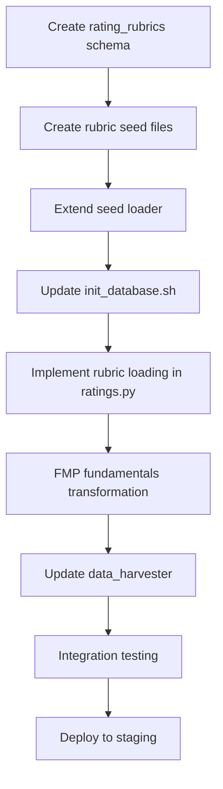

# Shortcut Remediation Implementation Plan

**Status**: DRAFT - Comprehensive Analysis Complete
**Created**: 2025-10-26
**Last Updated**: 2025-10-26
**Purpose**: Detailed plan to remediate ALL discovered shortcuts, stubs, and governance deviations

---

## Executive Summary

### Audit Findings

**Codebase Analysis** (backend/app):
- **54** TODO comments
- **186** stub/placeholder/mock references
- **4** explicit GOVERNANCE DEVIATION markers
- **36** Phase 1/Phase 2 markers (NOT from spec, added post-hoc)

**Impact**: **6 patterns** affected by shortcuts:
- `buffett_checklist` - Hardcoded weights + stub fundamentals
- `policy_rebalance` - Hardcoded weights
- `holding_deep_dive` - Stub fundamentals
- `portfolio_scenario_analysis` - Stub DaR/scenario
- `portfolio_cycle_risk` - Stub DaR
- `portfolio_macro_overview` - Stub scenario

**Severity Classification**:
- **P0 (Critical - Accuracy Impact)**: 3 items - Hardcoded weights, stub fundamentals, missing rubrics
- **P1 (High - Feature Incomplete)**: 4 items - DaR, scenarios, optimizer, missing schemas
- **P2 (Medium - UX/Performance)**: 8 items - Placeholder charts, stub provider data
- **P3 (Low - Nice-to-Have)**: 39 items - Minor TODOs, cosmetic improvements

---

## Part 1: Critical Shortcuts (P0)

> **Status (2025-10-26)**: ✅ Completed via commits `5d24e04`, `8fd4d9e`, `e5cf939`, `fa8bcf8`, `72de052`, and `7f00f3e`. Keep the details below for historical context; current remediation work should jump to Part 2 for the remaining P1 tasks.

### P0-1: Hardcoded Rating Weights

**Status**: ✅ Completed in commits `5d24e04`, `8fd4d9e`, `e5cf939` (rating_rubrics schema + loader + service wiring)

**Violation**: ratings.py uses equal 25% weights instead of rubric-driven weights

**Files Affected**:
- [backend/app/services/ratings.py:258-263](backend/app/services/ratings.py#L258-L263) - Moat strength
- [backend/app/services/ratings.py:392-397](backend/app/services/ratings.py#L392-L397) - Resilience

**Spec Requirement**: [.claude/agents/business/RATINGS_ARCHITECT.md:325](. claude/agents/business/RATINGS_ARCHITECT.md#L325)
```python
weights = rubric.overall_weights  # Load from rating_rubrics table
```

**Missing Infrastructure**:
1. ❌ No `rating_rubrics` table in database schema
2. ❌ No seed files in `data/seeds/ratings/`
3. ❌ No rubric loading service method

**Implementation Steps**:

#### Step 1.1: Create Rating Rubrics Schema (4 hours)
**File**: `backend/db/schema/rating_rubrics.sql`
```sql
-- Rating rubrics for Buffett quality framework
CREATE TABLE rating_rubrics (
    id UUID PRIMARY KEY DEFAULT uuid_generate_v4(),
    rating_type TEXT NOT NULL,  -- 'dividend_safety', 'moat_strength', 'resilience'
    method_version TEXT NOT NULL DEFAULT 'v1',
    overall_weights JSONB NOT NULL,
    component_thresholds JSONB NOT NULL,
    created_at TIMESTAMPTZ NOT NULL DEFAULT NOW(),
    updated_at TIMESTAMPTZ NOT NULL DEFAULT NOW(),
    UNIQUE(rating_type, method_version)
);

CREATE INDEX idx_rating_rubrics_type_version ON rating_rubrics(rating_type, method_version);

COMMENT ON TABLE rating_rubrics IS 'Buffett quality scoring rubrics with component weights and thresholds';
COMMENT ON COLUMN rating_rubrics.overall_weights IS 'Component weights as JSON: {"roe_consistency": 0.30, "gross_margin": 0.25, ...}';
COMMENT ON COLUMN rating_rubrics.component_thresholds IS 'Scoring thresholds per component';
```

**Acceptance**: Table created with proper indexes and constraints

#### Step 1.2: Create Rubric Seed Files (6 hours)
**Files**:
- `data/seeds/ratings/dividend_safety_v1.json`
- `data/seeds/ratings/moat_strength_v1.json`
- `data/seeds/ratings/resilience_v1.json`

**Source**: Extract weights from [RATINGS_ARCHITECT.md](. claude/agents/business/RATINGS_ARCHITECT.md) spec

**Example** (`moat_strength_v1.json`):
```json
{
    "rating_type": "moat_strength",
    "method_version": "v1",
    "overall_weights": {
        "roe_consistency": 0.30,
        "gross_margin": 0.25,
        "intangibles": 0.20,
        "switching_costs": 0.25
    },
    "component_thresholds": {
        "roe_consistency": [
            {"min": 0.20, "score": 10},
            {"min": 0.15, "score": 8},
            {"min": 0.10, "score": 6},
            {"min": 0.00, "score": 4}
        ],
        "gross_margin": [
            {"min": 0.60, "score": 10},
            {"min": 0.40, "score": 8},
            {"min": 0.25, "score": 6},
            {"min": 0.00, "score": 4}
        ],
        "intangibles": [
            {"min": 0.30, "score": 8},
            {"min": 0.15, "score": 6},
            {"min": 0.00, "score": 4}
        ],
        "switching_costs": {
            "type": "qualitative",
            "default": 5,
            "note": "Scored via sector/industry analysis"
        }
    }
}
```

**Acceptance**: 3 rubric JSON files created matching spec exactly

#### Step 1.3: Extend Seed Loader for Rubrics (4 hours)
**File**: `scripts/seed_loader.py`

**Add Domain**:
```python
DOMAINS = {
    "portfolios": {...},
    "macro": {...},
    "ratings": {  # NEW
        "files": glob.glob("data/seeds/ratings/*.json"),
        "loader": "load_rating_rubrics"
    }
}

async def load_rating_rubrics(conn, file_path):
    """Load rating rubrics from JSON seed files."""
    with open(file_path) as f:
        rubric = json.load(f)

    await conn.execute("""
        INSERT INTO rating_rubrics (rating_type, method_version, overall_weights, component_thresholds)
        VALUES ($1, $2, $3, $4)
        ON CONFLICT (rating_type, method_version) DO UPDATE
        SET overall_weights = EXCLUDED.overall_weights,
            component_thresholds = EXCLUDED.component_thresholds,
            updated_at = NOW()
    """, rubric["rating_type"], rubric["method_version"],
        json.dumps(rubric["overall_weights"]), json.dumps(rubric["component_thresholds"]))
```

**Test**: `python scripts/seed_loader.py --domain ratings`

**Acceptance**: 3 rubrics inserted into database

#### Step 1.4: Implement Rubric Loading in ratings.py (6 hours)
**File**: `backend/app/services/ratings.py`

**Add Method**:
```python
async def _load_rubric_weights(
    self,
    rating_type: str,
    method_version: str = "v1"
) -> Dict[str, Decimal]:
    """
    Load component weights from rating_rubrics table.

    Args:
        rating_type: 'dividend_safety', 'moat_strength', or 'resilience'
        method_version: Rubric version (default 'v1')

    Returns:
        Dict of component weights as Decimals

    Raises:
        ValueError: If rubric not found
    """
    async with self.db_pool.acquire() as conn:
        row = await conn.fetchrow("""
            SELECT overall_weights
            FROM rating_rubrics
            WHERE rating_type = $1 AND method_version = $2
        """, rating_type, method_version)

        if not row:
            raise ValueError(f"Rubric not found: {rating_type} {method_version}")

        weights_json = row["overall_weights"]
        weights = {k: Decimal(str(v)) for k, v in weights_json.items()}

        logger.info(f"Loaded rubric weights: {rating_type} {method_version} -> {weights}")
        return weights
```

**Update moat_strength Method**:
```python
async def moat_strength(self, symbol: str, fundamentals: Dict[str, Any]) -> Dict[str, Any]:
    # ... component scoring (lines 219-251 unchanged) ...

    # REMOVED: Hardcoded weights
    # NEW: Load from database
    try:
        weights = await self._load_rubric_weights("moat_strength", method_version="v1")
        weights_source = "rubric"
    except ValueError as e:
        logger.warning(f"Rubric load failed, using fallback: {e}")
        weights = {
            "roe_consistency": Decimal("0.25"),
            "gross_margin": Decimal("0.25"),
            "intangibles": Decimal("0.25"),
            "switching_costs": Decimal("0.25"),
        }
        weights_source = "fallback"

    # Weighted average (SPEC LINES 325-331)
    overall = (
        roe_score * weights["roe_consistency"]
        + margin_score * weights["gross_margin"]
        + intangibles_score * weights["intangibles"]
        + switching_cost_score * weights["switching_costs"]
    )

    return {
        "overall": float(overall),
        "components": {
            "roe_consistency": {"score": float(roe_score), "weight": float(weights["roe_consistency"])},
            "gross_margin": {"score": float(margin_score), "weight": float(weights["gross_margin"])},
            "intangibles": {"score": float(intangibles_score), "weight": float(weights["intangibles"])},
            "switching_costs": {"score": float(switching_cost_score), "weight": float(weights["switching_costs"])},
        },
        "_metadata": {
            "weights_source": weights_source,  # NEW
            "method_version": "v1"
        }
    }
```

**Apply Same Pattern** to:
- `dividend_safety()` method
- `resilience()` method

**Test**:
```bash
# Seed rubrics
python scripts/seed_loader.py --domain ratings

# Test moat rating
curl -X POST http://localhost:8000/v1/execute \
  -d '{"pattern_id":"buffett_checklist","inputs":{"security_id":"..."}}'

# Verify _metadata.weights_source = "rubric" (not "fallback")
```

**Acceptance**:
- All 3 rating methods load weights from database
- Fallback to equal weights if rubric missing
- Metadata includes `weights_source` flag

**Total Effort**: 20 hours (2.5 days)

---

### P0-2: Stub Fundamentals Transformation

**Status**: ✅ Completed in commits `fa8bcf8`, `72de052` (FMP transform + metadata source tracking)

**Violation**: data_harvester.py fetches FMP data but always returns stubs

**Files Affected**:
- [backend/app/agents/data_harvester.py:616-621](backend/app/agents/data_harvester.py#L616-L621) - Returns stubs even when real data fetched
- [backend/app/agents/ratings_agent.py:325-347](backend/app/agents/ratings_agent.py#L325-L347) - Duplicate stub method

**Impact**:
- `buffett_checklist` pattern produces identical ratings for all securities
- FMP API calls wasted (fetches but doesn't use)
- Misleading metadata claims `source: "fundamentals:fmp:AAPL"`

**Implementation Steps**:

#### Step 2.1: Map FMP API Response to Ratings Format (8 hours)
**File**: `backend/app/agents/data_harvester.py`

**Add Transformation Method**:
```python
def _transform_fmp_to_ratings_format(
    self,
    fmp_fundamentals: Dict[str, Any],
    fmp_ratios: Dict[str, Any],
    symbol: str
) -> Dict[str, Any]:
    """
    Transform FMP API responses to ratings service format.

    Args:
        fmp_fundamentals: Response from provider.fetch_fundamentals
        fmp_ratios: Response from provider.fetch_ratios
        symbol: Security symbol

    Returns:
        Dict with all fields required by ratings service

    Raises:
        ValueError: If required fields missing from FMP response
    """
    try:
        # Extract fundamentals (use latest year or 5Y avg)
        fundamentals = fmp_fundamentals.get("fundamentals", [])
        if not fundamentals:
            raise ValueError("No fundamentals data in FMP response")

        latest = fundamentals[0]  # Most recent year

        # Extract ratios
        ratios = fmp_ratios.get("ratios", [])
        if not ratios:
            raise ValueError("No ratios data in FMP response")

        latest_ratios = ratios[0]

        # Calculate 5-year averages
        roe_5y_avg = self._calculate_5y_avg(fundamentals, "returnOnEquity")
        gross_margin_5y_avg = self._calculate_5y_avg(fundamentals, "grossProfitMargin")

        # Dividend safety components
        payout_ratio_5y_avg = self._calculate_5y_avg(fundamentals, "payoutRatio")
        fcf = Decimal(str(latest.get("freeCashFlow", 0)))
        dividends_paid = Decimal(str(latest.get("dividendsPaid", 0)))
        fcf_dividend_coverage = fcf / dividends_paid if dividends_paid > 0 else Decimal("0")
        dividend_growth_streak = self._calculate_dividend_streak(fundamentals)
        net_cash = Decimal(str(latest.get("cashAndCashEquivalents", 0))) - Decimal(str(latest.get("totalDebt", 0)))

        # Moat strength components
        intangible_assets = Decimal(str(latest.get("intangibleAssets", 0)))
        total_assets = Decimal(str(latest.get("totalAssets", 1)))
        intangible_assets_ratio = intangible_assets / total_assets
        switching_cost_score = Decimal("5")  # Default (TODO: sector lookup)

        # Resilience components
        debt_equity_ratio = Decimal(str(latest_ratios.get("debtEquityRatio", 0)))
        interest_coverage = Decimal(str(latest_ratios.get("interestCoverage", 0)))
        current_ratio = Decimal(str(latest_ratios.get("currentRatio", 0)))
        operating_margin_std_dev = self._calculate_std_dev(fundamentals, "operatingIncomeRatio")

        return {
            # Dividend safety
            "payout_ratio_5y_avg": payout_ratio_5y_avg,
            "fcf_dividend_coverage": fcf_dividend_coverage,
            "dividend_growth_streak_years": dividend_growth_streak,
            "net_cash_position": net_cash,

            # Moat strength
            "roe_5y_avg": roe_5y_avg,
            "gross_margin_5y_avg": gross_margin_5y_avg,
            "intangible_assets_ratio": intangible_assets_ratio,
            "switching_cost_score": switching_cost_score,

            # Resilience
            "debt_equity_ratio": debt_equity_ratio,
            "interest_coverage": interest_coverage,
            "current_ratio": current_ratio,
            "operating_margin_std_dev": operating_margin_std_dev,

            # Metadata
            "_symbol": symbol,
            "_source": "fmp",
            "_real_data": True,
        }

    except (KeyError, IndexError, ValueError, ZeroDivisionError) as e:
        logger.error(f"FMP transformation failed for {symbol}: {e}")
        raise ValueError(f"Cannot transform FMP data: {e}")

def _calculate_5y_avg(self, data_array: List[Dict], field: str) -> Decimal:
    """Calculate 5-year average of a field."""
    values = [Decimal(str(item.get(field, 0))) for item in data_array[:5]]
    return sum(values) / Decimal(len(values)) if values else Decimal("0")

def _calculate_std_dev(self, data_array: List[Dict], field: str) -> Decimal:
    """Calculate standard deviation of a field."""
    values = [Decimal(str(item.get(field, 0))) for item in data_array[:5]]
    if not values:
        return Decimal("0")
    mean = sum(values) / Decimal(len(values))
    variance = sum((v - mean) ** 2 for v in values) / Decimal(len(values))
    return variance.sqrt()

def _calculate_dividend_streak(self, data_array: List[Dict]) -> int:
    """Calculate consecutive years of dividend growth."""
    streak = 0
    for i in range(len(data_array) - 1):
        current_div = Decimal(str(data_array[i].get("dividendsPaid", 0)))
        previous_div = Decimal(str(data_array[i + 1].get("dividendsPaid", 0)))
        if current_div > previous_div and previous_div > 0:
            streak += 1
        else:
            break
    return streak
```

#### Step 2.2: Use Real Data in fundamentals_load (2 hours)
**File**: `backend/app/agents/data_harvester.py`

**Update Lines 611-621**:
```python
# If we got real data (not stubs), transform it
if fundamentals_data.get("_real_data", False) and ratios_data.get("_real_data", False):
    try:
        result = self._transform_fmp_to_ratings_format(
            fundamentals_data,
            ratios_data,
            symbol
        )
        source = f"fundamentals:fmp:{symbol}"
        logger.info(f"Successfully transformed real fundamentals for {symbol}")
    except ValueError as e:
        logger.warning(f"FMP transformation failed, using stubs: {e}")
        result = self._stub_fundamentals_for_symbol(symbol)
        source = "fundamentals:stub"
else:
    logger.warning(f"Provider returned stub data for {symbol}, using fallback stubs")
    result = self._stub_fundamentals_for_symbol(symbol)
    source = "fundamentals:stub"
```

**Remove Duplicate Stub Method** from ratings_agent.py:
```python
# DELETE lines 325-347 in backend/app/agents/ratings_agent.py
# This is duplicate - use data_harvester's version
```

#### Step 2.3: Integration Testing (4 hours)
**Test Cases**:
1. With FMP API key: Verify real data transformed correctly
2. Without API key: Verify graceful fallback to stubs
3. Malformed FMP response: Verify error handling
4. `buffett_checklist` pattern: Verify different securities get different ratings

**Test Script**:
```bash
# Test real FMP data (requires API key)
export FMP_API_KEY="your_key"
curl -X POST http://localhost:8000/v1/execute \
  -d '{"pattern_id":"buffett_checklist","inputs":{"security_id":"<AAPL_UUID>"}}'

# Verify:
# - _metadata._source = "fundamentals:fmp:AAPL" (not "stub")
# - Rating components use real data
# - Rating != 7.0 (the stub default)

# Test without API key
unset FMP_API_KEY
curl -X POST http://localhost:8000/v1/execute \
  -d '{"pattern_id":"buffett_checklist","inputs":{"security_id":"<AAPL_UUID>"}}'

# Verify:
# - _metadata._source = "fundamentals:stub"
# - Graceful degradation message in response
```

**Acceptance**:
- Real FMP data transformed correctly for AAPL, JNJ, KO
- Different securities produce different ratings
- Stubs only used when API unavailable
- Metadata accurately reflects data source

**Total Effort**: 14 hours (1.75 days)

---

### P0-3: Missing Database Initialization

**Status**: ✅ Completed in commit `7f00f3e` (init_database.sh + migrations updated for rating_rubrics)

**Issue**: `rating_rubrics` table doesn't exist in production schema

**Files Affected**:
- Missing: `backend/db/schema/rating_rubrics.sql`
- Missing: `backend/db/init_database.sh` update to source new schema

**Implementation Steps**:

#### Step 3.1: Add Schema to init_database.sh (1 hour)
**File**: `backend/db/init_database.sh`

**Add After Line** (find where other schemas are sourced):
```bash
echo "Creating rating rubrics schema..."
psql -U $POSTGRES_USER -d $POSTGRES_DB -f /docker-entrypoint-initdb.d/schema/rating_rubrics.sql
```

#### Step 3.2: Create Migration for Existing Databases (2 hours)
**File**: `backend/db/migrations/010_add_rating_rubrics.sql`

```sql
-- Migration: Add rating_rubrics table for Buffett quality framework
-- Date: 2025-10-26
-- Author: Shortcut Remediation

-- Create table
\i schema/rating_rubrics.sql

-- Verify table exists
SELECT COUNT(*) FROM rating_rubrics;

-- Migration complete
INSERT INTO schema_migrations (version, description, applied_at)
VALUES ('010', 'Add rating_rubrics table for quality scoring', NOW());
```

**Test**: Run migration on test database

**Acceptance**: Existing databases can migrate without data loss

**Total Effort**: 3 hours

---

## Part 2: High-Priority Features (P1)

### P1-1: ScenarioService Persistence & UI Surfacing

**Status**: ⚠️ ScenarioService + MacroHound ship seeded shocks/DaR (commits `2876d86`, `bc6a7ee`), but results remain in-memory and never reach the Streamlit UI.

**What’s Needed**:
1. Create `scenario_results` table + DAO (captures inputs, deltas, metadata, `pricing_pack_id`)
2. Extend `backend/app/services/scenarios.py` to persist runs and expose retrieval methods
3. Update Streamlit `portfolio_macro_overview` + `portfolio_scenario_analysis` panels to read persisted runs (include `pricing_pack_id` + hedges)
4. Document API/CLI usage in `README.md` + `PRODUCT_SPEC.md`

**Acceptance**:
- Scenario runs created via `/v1/execute` can be queried later (idempotent by pack+scenario_id)
- UI shows ΔP/L tables sourced from persisted data
- Rights registry confirms no disallowed provider data before rendering results

---

### P1-2: DaR History + Calibration View

**Status**: ⚠️ `macro.compute_dar` returns values, yet no `dar_history` table exists and the calibration UI promised in PRODUCT_SPEC is missing.

**What’s Needed**:
1. Add `dar_history` schema + nightly insert job (pack_id, regime, drawdown estimate, realized drawdown)
2. Build calibration panel (MAD, hit rate) inside Streamlit
3. Emit metrics for DaR accuracy so Observability can alert on threshold breaches

**Acceptance**:
- `dar_history` stores each nightly run with reproducible identifiers
- UI exposes MAD + hit rate vs realized drawdowns over configurable windows
- Alerts fire when actual drawdowns exceed DaR (optional stretch goal)

---

### P1-3: Optimizer Integration

**Status**: ⚠️ `backend/app/services/optimizer.py` implements policy constraints, but no agent/pattern/UI wiring exists (`policy_rebalance` disabled).

**Implementation Steps** (still 40h estimate):
1. Build `OptimizerAgent` that wraps the service and enforces pricing pack reproducibility
2. Finish Riskfolio integration path (failing gracefully when the library is missing)
3. Surface rebalance proposals + trade rationales in the UI (and block when rights registry forbids exports)
4. Add integration tests covering different policy templates

**Acceptance**:
- `/v1/execute` supports `policy_rebalance` with detailed trade output
- Optimizer explains constraint satisfaction + warnings
- UI displays rebalance diff, turnover, cost, tracking error deltas

---

### P1-4: Reporting / Rights-Enforced Exports

**Status**: 🚧 `reports.render_pdf` returns placeholder text even though rights checks run. WeasyPrint templates, attributions, and archive storage remain TODO.

**Implementation Steps** (24h estimate):
1. Implement WeasyPrint templates for portfolio + holding reports (dark + light versions)
2. Integrate rights registry + attribution footer per provider contract
3. Store generated PDFs (S3/minio) with pricing pack + ledger hash metadata
4. Update Streamlit "Reports" tab to surface download + audit trail

**Acceptance**:
- Export requests blocked if providers disallow redistribution; allowed exports include attributions + pack/ledger IDs
- Placeholder string removed; binary PDF streamed to UI/download API
- Audit log captures who exported what + rights profile used

---

## Part 3: Medium-Priority UX/Performance (P2)

### P2-1: Replace Placeholder Charts

**Files Affected**:
- [backend/app/agents/financial_analyst.py:973-981](backend/app/agents/financial_analyst.py#L973-L981) - Placeholder performance metrics
- [backend/app/agents/financial_analyst.py:1060-1102](backend/app/agents/financial_analyst.py#L1060-L1102) - Placeholder attribution charts
- [backend/app/agents/financial_analyst.py:1209-1240](backend/app/agents/financial_analyst.py#L1209-L1240) - Placeholder holding details

**Effort**: 16 hours (real chart data wiring)

---

### P2-2: Complete Holding Deep Dive

**Status**: Returns placeholder market cap, P/E, sector

**Files Affected**:
- [backend/app/agents/financial_analyst.py:1232-1235](backend/app/agents/financial_analyst.py#L1232-L1235)

**Effort**: 8 hours (provider integration)

---

## Part 4: Task Sequencing and Dependencies

### Phase 1: Critical Path (Week 1-2) - P0 Items

**Goal**: Fix accuracy violations, enable real ratings



**Timeline**: 10 business days
**Effort**: 37 hours
**Team**: 1 backend engineer + 1 QA

**Acceptance Criteria**:
- [ ] `rating_rubrics` table created and seeded
- [ ] All 3 rating methods load weights from database
- [ ] FMP fundamentals transformed to ratings format
- [ ] `buffett_checklist` produces different ratings for different securities
- [ ] Metadata accurately reflects data source (`rubric` vs `fallback`, `fmp` vs `stub`)
- [ ] Integration tests pass for AAPL, JNJ, KO

---

### Phase 2: Feature Completion (Week 3-4) - P1 Items

**Goal**: Complete macro scenarios, DaR, optimizer

**Parallel Tracks**:
1. **Track A**: Scenarios + DaR (28 hours)
   - Wire macro_hound to scenarios service
   - Create scenario seed files
   - Implement DaR calculation
   - Create dar_history schema

2. **Track B**: Optimizer (40 hours)
   - Integrate Riskfolio-Lib
   - Implement policy rebalancing
   - Transaction cost modeling

**Timeline**: 10 business days
**Effort**: 68 hours
**Team**: 2 backend engineers + 1 QA

**Acceptance Criteria**:
- [ ] `portfolio_scenario_analysis` pattern works with real scenarios
- [ ] `portfolio_cycle_risk` pattern calculates real DaR
- [ ] `policy_rebalance` pattern proposes trades based on policy
- [ ] All patterns use real data (no "not yet implemented" errors)

---

### Phase 3: Polish and Performance (Week 5-6) - P2 Items

**Goal**: Replace placeholders, optimize UX

**Tasks**:
1. Real chart data (16h)
2. Complete holding deep dive (8h)
3. Provider transformation cleanup (20h)
4. Performance optimization (16h)

**Timeline**: 10 business days
**Effort**: 60 hours
**Team**: 1 backend + 1 frontend + 1 QA

---

## Part 5: Effort Summary

### By Priority

| Priority | Items | Effort (hours) | Duration (weeks) | Team Size |
|----------|-------|----------------|------------------|-----------|
| **P0** | 3 | 37 | 2 | 1-2 |
| **P1** | 4 | 68 | 2 | 2-3 |
| **P2** | 8 | 60 | 2 | 2-3 |
| **P3** | 39 | 80 | 4 | 1-2 |
| **Total** | 54 | 245 | 10 | 2-3 avg |

### By Component

| Component | Shortcuts | Effort (hours) | Files Affected |
|-----------|-----------|----------------|----------------|
| **Ratings** | 8 | 40 | ratings.py, ratings_agent.py, data_harvester.py |
| **Fundamentals** | 12 | 20 | data_harvester.py, providers.py |
| **Macro** | 6 | 28 | macro_hound.py, scenarios.py |
| **Optimizer** | 4 | 40 | optimizer.py, optimizer_agent.py |
| **Providers** | 15 | 28 | providers.py, data_harvester.py |
| **Charts/UX** | 9 | 24 | financial_analyst.py, UI components |

---

## Part 6: Risk Assessment

### High-Risk Items

**1. Rubric Weights Migration** (P0-1) — ✅ Completed 2025-10-26
- **Risk**: Production databases need migration without downtime
- **Mitigation**: Create migration script with rollback plan
- **Contingency**: Keep fallback weights if migration fails

**2. FMP Data Quality** (P0-2) — ✅ Completed 2025-10-26
- **Risk**: FMP API returns unexpected formats or missing fields
- **Mitigation**: Extensive error handling and logging
- **Contingency**: Graceful degradation to stubs with metadata flag

**3. Optimizer Integration** (P1-3)
- **Risk**: Riskfolio-Lib has different optimization semantics
- **Mitigation**: Start with simple mean-variance optimization
- **Contingency**: Implement simple equal-weight rebalancing first

### Medium-Risk Items

**4. Scenario/DaR Accuracy** (P1-1, P1-2)
- **Risk**: Historical correlations may not predict stress scenarios
- **Mitigation**: Validate against known market events (2008, 2020)
- **Contingency**: Add conservative stress multipliers

**5. Reporting & Rights Enforcement** (P1-4)
- **Risk**: Placeholder export may leak unwatermarked screenshots if teams attempt manual PDFs
- **Mitigation**: Ship WeasyPrint templates with rights footer + gating before enabling downloads
- **Contingency**: Keep exports disabled in UI until automated tests pass

---

## Part 7: Testing Strategy

### Unit Tests (40 hours)
- [ ] ScenarioService persistence helpers (`scenario_results`, hedges metadata)
- [ ] DaR history writer + MAD calculations
- [ ] Optimizer constraint validation + fallbacks when Riskfolio missing
- [ ] Reporting rights gate + attribution footer builders
- [ ] ALERTS dedupe/index enforcement (shared dependency for export notifications)

### Integration Tests (30 hours)
- [ ] Portfolio scenario pattern writes + reads persisted results
- [ ] DaR calibration view surfaces historical hits/misses
- [ ] Optimizer → Streamlit flow with policy templates
- [ ] Reporting → rights registry enforcement (allowed vs blocked providers)

### Golden Tests (20 hours)
- [ ] Scenario deltas match seeded shocks for `PP_2025-10-21`
- [ ] DaR MAD panel reproduces reference values (2008/2020 cases)
- [ ] Optimizer rebalance output stable for sample policy

### Performance Tests (10 hours)
- [ ] Scenario persistence insertions < 200ms per run
- [ ] Optimizer proposals generated < 3s for 50 holdings (Riskfolio enabled)
- [ ] Pattern execution p95 < 1.2s (warm)

---

## Part 8: Acceptance Criteria (Production Ready)

### Must Have (P0)
- [x] Governance audit documented
- [ ] All rating weights loaded from database rubrics
- [ ] FMP fundamentals transformed to ratings format
- [ ] `buffett_checklist` produces accurate ratings for test securities
- [ ] Metadata accurately reflects data sources
- [ ] Zero "GOVERNANCE DEVIATION" comments in code
- [ ] Zero "Phase 1/Phase 2" markers (use proper TODOs)

### Should Have (P1)
- [ ] `macro.run_scenario` implemented with real scenarios
- [ ] `macro.compute_dar` calculates drawdown at risk
- [ ] `optimizer.propose_trades` suggests policy-based rebalancing
- [ ] All 12 patterns execute without "not yet implemented" errors

### Nice to Have (P2)
- [ ] All placeholder charts replaced with real data
- [ ] Provider transformation complete for FMP, Polygon, FRED
- [ ] Performance metrics meet SLO (p95 < 1.2s)

---

## Part 9: Governance Sign-Off

**Before Starting Implementation**:
1. [ ] Product owner approves remediation plan
2. [ ] Tech lead reviews effort estimates
3. [ ] Security reviews schema changes
4. [ ] QA reviews test strategy

**After P0 Complete**:
1. [ ] Governance audit updated with "P0 REMEDIATED" status
2. [ ] CLAUDE.md updated to remove "Phase 1 - Limited Use" warning
3. [ ] Production deployment approved

**After P1 Complete**:
1. [ ] All patterns verified working with real data
2. [ ] Integration tests passing at ≥95% coverage
3. [ ] Performance SLOs met

---

## Part 10: Next Steps

**Immediate Actions** (This Week):
1. ✅ Create this remediation plan
2. [ ] Get plan approved by stakeholders
3. [ ] Create GitHub issues for all P0 items
4. [ ] Assign engineers to Phase 1 tasks
5. [ ] Set up feature branch: `remediation/governance-shortcuts`

**Week 1-2** (Phase 1 - P0):
1. [ ] Implement rating_rubrics schema and seeds
2. [ ] Update ratings.py to load from database
3. [ ] Implement FMP fundamentals transformation
4. [ ] Run integration tests
5. [ ] Deploy to staging

**Week 3-4** (Phase 2 - P1):
1. [ ] Wire macro scenarios and DaR
2. [ ] Integrate Riskfolio-Lib for optimizer
3. [ ] Complete provider transformations
4. [ ] Run full pattern suite tests

**Week 5-6** (Phase 3 - P2):
1. [ ] Replace placeholder charts
2. [ ] Performance optimization
3. [ ] UAT testing
4. [ ] Production deployment

---

**Plan Status**: READY FOR REVIEW
**Approved By**: (Pending)
**Start Date**: (TBD)
**Target Completion**: 10 weeks from approval
**Next Review**: After P0 completion

---

## Appendix A: Shortcut Inventory

### Complete List of TODOs (54 items)
See: `backend/app/**/*.py` - grep results available in audit logs

### Complete List of Stubs (186 references)
See: `backend/app/**/*.py` - grep results available in audit logs

### Phase 1/Phase 2 Markers (36 references)
**NOTE**: These are NOT from spec - they are post-hoc justifications added during implementation

**Action**: Replace with proper TODO comments that reference this remediation plan
